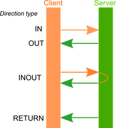

## Identifiers, literals, whitespace
#### Identifiers
Follow the same rules as in C/C++. Identifiers must start with an alphabetic character or underscore, and may include alphanumeric characters and underscores.
#### Literals
The following literal values are supported:
* **Integer**: Decimal (base 10) is the default. Hex values are prefixed with '0x' and binary values are prefixed with '0b'. Integer literals may be suffixed with 'u', 'ul', or 'ull', and are case-insensitive.
* **Floating point**: A decimal point prefixed and/or suffixed by decimal character sequences. The decimal point is required to form a floating point value. The optional exponent follows with no extra whitespace, consists of an 'e' or 'E', optional +/-, and a decimal sequence.
* **Strings**: are contained in double quotes. The usual escape sequences that begun with a backslash are supported, as well as hex character escapes such as "\x7d". Multiple consecutive string literals are accepted anywhere a string is valid in the grammar, and are concatenated into a single string.

#### Whitespace
All whitespace is ignored in the input file.

## Expressions, operators
An expression is accepted in any place where an integer or floating point value is required.

#### Supported binary and unary operators
Operator | Function | Operator | Function
---|---|---|---
+| addition | ^ | binary XOR
-| subtraction | << | left shift
*| multiplication | >> | right shift
/| division
%| modulo | + | no-op (unary operator)
&amp; | binary AND | - | negate (unary operator)
&#124; | binary OR | ~ | binary inverse (unary operator)

The usual precedence rules apply. Sub-expressions may be placed in parentheses ( ) to override normal precedence rules.

## Imports
Another IDL file can be included in the parse by using the ``import`` keyword.

*Prototype:*
```C
import string
```

The _string_ contains just the name, or the name-contained file path to the IDL file. The file path is relative to the base IDL file, or the file path could be relative to the given path to the eRPC generator.

## Annotations
Annotations provide a way to inform the eRPC generator about specific requests for some parts of the code.
* Unrecognized annotations are ignored by code generators.
* Each annotation starts with the “``@``” character.
* Then optionally can be inserted program language specifier followed with colon  “``c:``”. Currently supported program language specifiers are ``c`` ( for C), ``py`` ( for Python). **Do not use with function/interface id annotation.**
* Then it is followed by the annotation name; for example, ``@external``.

This is enough for one type of annotation (when you want to only inform the eRPC generator about a specific attribute of the code). The second type of annotation is extended using the “( )” parentheses. A specific parameter can be placed inside parentheses. This can be a number, text, or other things.

#### Supported annotations:

##### ``@crc``
When this annotation is used, then crc value is generated based on eRPC version and IDL file. User can access this value through _extern const uint32_t erpc_generated_crc;_. This value can be then set to eRPC tranport. Thanks to this transport checks if client and server have same eRPC version and IDL files without adding any execution code.  Project need include "erpc_crc16.h" header file.

##### ``@discriminator(string)``
When non-encapsulated unions are used, discriminator needs be specified with using this annotation.

##### ``@error_return(value)``
When the annotation ``@error_return`` is set, then this _value _ is used for the return value from the client-side called function, when the error will occur inside.

##### ``@external int32 i``
The ``@external`` annotation allows you to reference a type in an IDL file that already exists in another header file. In order for this to work, the type must be identically defined in the IDL file.

For example, if you have a typedef in a header file (``typedef uint32_t erpc_status_t``), and want to use this typedef, then define the type in your IDL file using the @external annotation: ``@external type erpc_status_t = uint32``.
* This allows *erpcgen* to perform type checking when parsing the IDL file, but it will not generate any code for the type.
* This prevents duplicate definitions of the same type.
* This should work for all type definitions in an IDL file (struct, const, enum, typedef).

##### ``@group(string)``
Interfaces can be grouped and stored in their set of output files via using ``@group`` annotation. ``String`` represent group name, which is used for output files. The file names look like: ``<fileName>_<groupName>``.

Filename | Description
---|---
<*outputFileName*>_<*groupName*>.h | Common header file for group
<*outputFileName*>_<*groupName*>_client.cpp | Client shim implementation for group
<*outputFileName*>_<*groupName*>_server.h | Server side header for group
<*outputFileName*>_<*groupName*>_server.cpp | Server shim implementation for group

##### ``@id(number)``
Annotation  ``@id`` set interface/function id number. The _number_ must be unique for each interface/function.

##### ``@include(string)``
The ``string`` value represents the header file to include.

##### ``@length(value)``
This annotation set reference for length _variable_. This can be either a number or variable. This prevents from wrapping list and binary data types to structure. Instead of structure, these data types are present as pointer to the element type. The length of pointer variable depends on _value_.

##### ``@max_length(value)``
Annotation ``@max_length`` sets the maximum size of the string value. This size need be allocated by the client. This annotation simply informs the server how big of a space should be allocated to working with this variable. For example, when the variable is used as the ``inout`` type and the server needs to send back a bigger string, then the client sends it to them.

##### ``@name(string)``
Annotation ``@name`` sets data type, function's param or structure's member name. This is invented for cases when the erpcgen is complaining about using IDL's reserved words, but for selected output programming language these are not reserved words.

##### ``@no_alloc_errors``
Generated files have a default-enabled generating _error checking code_ for catching errors from bad allocations. For disabling generating _errors checking code_ for bad allocation just add ``@no_alloc_errors``.

##### ``@no_const_param``
When this annotation is set to program, then no "const" word are generated for functions parameters. This can be used also for function or parameter.

##### ``@no_infra_errors``
Generated files have a default-enabled generating _error checking code_ for catching errors from codec functions. For disabling generating _errors checking code_ from codec, just add ``@no_infra_errors`` annotation.

##### ``@nullable``
Annotation ``@nullable`` informs shim code that variables can be set to NULL. Without this annotation, the variable (passed by client, or returned from the server function implementation) cannot be NULL.

##### ``@output_dir(string)``
String value that represents the output path. The output directory can also be set as a command line option for the eRPC generator. When ``@output_dir(string)`` and the eRPC generator command line option are both used, the path from the IDL file is appended to the path given to the eRPC generator.

##### ``@retain``
Annotation ``@retain`` prevents the server to call freeing functions on variables, which are used in server function implementation.

##### ``@shared``
When this annotation is set to function's parameter or structure's member, then data are not serialized, just an address to data. This can be used in multicore system with shared memory pool.

##### ``@shared_memory_begin(value)``
This annotation sets begin address of shared memory. When this is used generated code controls if given address is from this memory pool.

##### ``@shared_memory_end(value)``
This annotation sets end address of shared memory. When this is used generated code controls if given address is from this memory pool.

##### ``@types_header(string)``
All type declarations (for example typedef and struct) will be moved into the defined header file. This prevents duplicate definition errors when using ``@group``.


## Program
The optional ``program`` statement is used to specify the name of the input as a whole. This name is used for the output file name.

```C
program some_program_name
```

The ``program`` statement does not cause any code to generate by itself. It is used both for documentation purposes and as an anchor point to which annotations may be attached. Annotations must be placed before the ``program`` statement.

### Supported annotations
```
@crc
@dynamic_services
@include(string)
@no_alloc_errors
@no_const_param
@no_infra_errors
@output_dir(string)
@shared_memory_begin(value)
@shared_memory_end(value)
@types_header
```

## Interfaces
The interface contains one or more functions, which are called on the client side. The implementations are written on the server side.

*Prototype:*
```C
interface _interfaceName_ {}
```

Interfaces also generate one more special function. Because generated functions are written as C++ functions (they use classes), C-users generate C-function ``create_<interfaceName>_service()``. This function should be the call function.

### Supported annotations
Supported annotations are used _before a interface declaration_.

```
@group(string)
@id(number)
@include(string)
@name(string)
```

## Functions
Functions are called by the client, and the implementations are written on the server side. There are two supported IDL function declarations:

```C
oneway function()
```

The oneway function should be used when no return message is expected.

```C
function() -> returnDataType
```

This function should be used when a return message is expected (for example, the returning value). The difference between using the ``oneway`` and ``void`` is that the ``void`` function waits for a response from the server side.
Attributes are placed inside parentheses ( ), similar to how it is done in C-functions (using the supported IDL data types).

### Supported annotations
Supported annotations are used _before a function declaration_.

```
@error_return(value)
@external
@id(number)
@name(string)
@no_const_param
```

### Functions parameters annotations
Parameters annotations are set after parameter name. Supported annotations are described for each data type in chapters bellow.
*Prototype:*
```C
function(string a @max_length(10), list<int32> b @length(c), int32 c) -> @nullable list<int32>
```

## Data types supported
These are the built-in, atomic, scalar, complex types supported by ``erpcgen``. These types are mostly self-explanatory.

##### Supported annotations
```
@external
@name(string)
@no_const_param
@shared
```

### Alias (type definition)
The IDL type representation for this is: ``type _aliasName_ = _originalType_``

IDL definition | C definition |
---|---
type _aliasName_ = int32 | typedef int32_t _aliasName_;
type _aliasName_ = list<int32> | typedef list_int32_1_t _aliasName_;
type _aliasName_ = int32[20] | typedef int32_t _aliasName_[20];

### Built-in types
The built-in atomic types convert to standard integer types. The string type converts directly to a char*.

| IDL definition | C definition | IDL definition | C definition
---|---|---|---
bool | bool | uint8 | uint8_t
int8 | int8_t | uint16 | uint16_t
int16 | int16_t | uint32 | uint32_t
int32 | int32_t | uint64 | uint64_t
int64 | int64_t | float | float
string |  char* | double | double

#### Strings and UTF-8
The string length is determined by the terminating null byte, which means that no null characters may be included in the middle of the string. The major impact of this is that UTF-8 is not fully supported. If the arbitrary UTF-8 text is intended to be transferred, then the binary type must be used.

##### Supported annotations
```
@max_length(value)
@nullable
@retain
```

#### Binary
As default the binary type generates a C-type equivalent to ``list<uint8>``. The differences between binary type and list type are:
* Binary data type is handled far more efficiently when serializing and deserializing.
* Binary type has different names of structure members.
```C
typedef struct binary_t binary_t;
struct binary_t {
    int8_t *data;
    uint32_t dataLength;
};
```

##### Supported annotations
```
@length(value)
@max_length(value)
@retain
```


### Enumerations
Enumerations in the IDL input generate matching enumeration definitions in C. The only difference is that constant expressions are evaluated in the output. Additionally, a ``typedef`` with a matching name is generated.

#### IDL definition
```C
enum enumColor {
    red,
    green = 10,
    blue = 2 * 10
}
```

#### C definition
```C
typedef enum enumColor {
    red,
    green = 10,
    blue = 20
} enumColor;

```
##### Supported annotations
```
@name(string)
```

## Structures
Structures are created with an implicit ``typedef`` for the name provided in the IDL file. When "byref" keyword is used in front of structure's member declaration, then structure's member is serialized through reference.

#### IDL definition
```C
struct A {
    int32 a
    byref float b
}
```

#### C definition
```C
typedef struct A A;
struct A {
    int32_t a;
    float *b;
};
```

Two helper functions are generated for encoding and decoding structures. The prototypes for such functions are:
  * ``int32_t read_<struct_typename>_struct(erpc::Codec * in, <struct_typename> * data);``
  * ``int32_t write_<struct_typename>_struct(erpc::Codec * out, <struct_typename> * data);``

For all functions that either _return a structure_ or _pass a structure as a parameter_, those functions expect a pointer to the structure type.

#### Supported annotations
```
@name(string)
@nullable
@retain
```

### Discriminated Unions
A discriminated union allows a user to create a kind of variant object, thereby allowing a user to send or return data of different types. The definition of a discriminated union in the IDL file uses a _switch-statement-like_ syntax to define which union member is valid for the corresponding discriminator value. The eRPC is recognizing two types of discriminated unions:

`1.` Non-encapsulated union: A definition of union type is placed in global scope. A discriminator needs be defined through annotation ``@discriminator(disriminator_name)``.

#### IDL definition
```C
enum enumType{ A, B, C, D, E, F }
union unionType
{
    case A:
        int32 a
    case B:
        float b
    case C:
    case D, E:
        list<int32> c
    case F:
        int32 x
        int32 y
    default:
        int32 z
}

struct A
{
    int32 discriminator;
    unionType data @discriminator(discriminator);
}
```

#### C definition
```C
enum enumType
{
    A=1,
    B=2,
    C=3,
    D=4,
    E=5,
    F=6
}enumType;

typedef union unionType unionType;
typedef struct A A;

union unionType
{
    int32_t a;
    float b;
    list_int32_1_t c;
    struct {
        int32_t x;
        int32_t y;
    };
    int32_t z;
};

struct A {
    int32_t discriminator;
    unionType data;
};
```

#### Supported annotations
```
@discriminator
@name(string)
@nullable
@retain
```

`2.` Encapsulated unions: A definition of union type is part of a structure with one or more scalar types, one or more unions, and any other necessary data members for the struct. A discriminator is presented as member of current structure.

#### IDL definition
```C
enum { A, B, C, D, E, F }
struct A {
    int32 discriminator
    union(discriminator)
    {
        case A:
            int32 a
        case B:
            float b
        case C:
        case D, E:
            list<int32> c
        case F:
            int32 x
            int32 y
        default:
            int32 z
    } data
}
```

#### C definition
```C
enum enumType
{
    A=1,
    B=2,
    C=3,
    D=4,
    E=5,
    F=6
}enumType;

typedef struct A A;

struct A {
    int32_t discriminator;
    union
    {
        int32_t a;
        float b;
        list_int32_1_t c;
        struct {
            int32_t x;
            int32_t y;
        };
        int32_t z;
    } data;
};
```

#### Supported annotations
```
@name(string)
```

Discriminated unions have a few special features:
* As shown for cases C, D, and E, you can assign the same union member to multiple discriminator values, either by allowing case definitions to fall through, or by providing a list of discriminator values within a single case.
* Case F shows that discriminated unions also allow generation of anonymous structs within the union.
* There is also the ‘default’ case, which is invoked if the discriminator value is set to something not defined explicitly by one of the union cases within the IDL.

### Lists
The IDL type representation for this type is ``list<typename>``.

Because the C language does not have a built-in list type, the generator must synthesize one (a list type) when generating code. This is done by combining an array pointer with a list element count in a structure. Each unique list type specified in the IDL causes a new structure type to be defined.

The conversion is very straightforward. For ``list<int32>``, this code is generated:
```C
struct list_int32_1_t {
    int32_t * elements;
    uint32_t elementsCount;
};
```
Type definitions for the list structures are generated in a separate _forward declarations_ section of the output file.

For simplicity, the names of the synthesized list structures are currently set to "list_x_y_t", where x is base type and  y is a unique integer. It is recommended to create a type alias to define a user-friendly name for the list structure. The issue is that the list structure names _that include an element type description_ could potentially become excessively long.

#### Supported annotations
```
@length
@max_length
@nullable
@retain
```

### Arrays
The IDL type representation for this type is ``typeName[N] variableName``, where ``N`` is an integer constant expression.

| IDL definition | C definition |
---|---
int32[10] variable | int32_t variable[10];
int32[10][6] variable | int32_t variable[10][6];

#### IDL definition
```C
functionName(int [8][10] a) -> int [8][4]
```

#### C definition
```C
int * (functionName(int32_t a[8][10]))[8][4];
```

#### Supported annotations
```
@retain
```

### Callbacks
Callback is another name of the function data type. This data type can be used as others' data types. This data type is intended for sending the function reference through eRPC call to the second side. The second side can then be the executed real function. The Callback type is declared outside of the interface. The Callback function is declared inside interface. The Callback function is regular eRPC function, which the address can be passed to the another eRPC function as a parameter value.

#### IDL definition
```C
oneway callback1_t(int32 a, int32 b)

interface Core0Interface
{
    oneway myFun(in callback1_t pCallback1_t)

    @include("callbacks1.h")
    callback1_t callback1; // Function declaration
}
```

#### C definition
```C
typedef void (*callback1_t)(int32_t a, int32_t b);

void myFun(const callback1_t pCallback1_t);

void callback1(int32_t a, int32_t b);
```
#### Supported annotations
```
@no_const_param
@nullable
```

## Constants
The IDL supports declarations of constants. These constants are replicated in the generated output. Constants are defined with the ``const`` keyword. They look just like the constant global variables in C, and include a type and name (in that order).

String constant prototype: ``const string kVersion = stringValue``

## Generating functions based on parameter direction and return value
Supported keywords for parameter directions are: ``in``, ``out``, and ``inout``. These keywords are used to specify the parameter direction type. The direction keywords are placed before the parameter type. If the direction for a parameter is not specified, then it is the ``in`` direction.

For example: ``void function(out int32 param)``

The next figure shows who is sending and who is receiving the parameter value.



How memory allocations are provided depends on the type of application:
* **On client-side applications:** all memory allocations have to be provided by user code.
* **On server-side applications:** all memory allocations are provided by server shim code. The user cannot change the memory allocation provided by the shim code.

The next table shows how data types are translated from IDL to C as function parameters.

Data type | in | out | inout | Returns |
---|---|---|---|---
**Built-in types** | int32 param | int32 *param | int32 *param | int32
**string** | char *param | _char *param_ | char *param | _Not supported_
**enum** | B param | B *param | B *param | B
**struct** | const A *param | A *param | A *param | _Not supported_
**list** | const list_int32_1_t *param | list_int32_1_t *param | list_int32_1_t *param | _Not supported_
**array** | const int32 param[5] | int32 param[5] | int32 param[5] | _Not supported_

If a type definition is used, then all pointers are generated as shown in the two previous tables. Instead of these types, the type definition name is used.
The variable needs to have a set annotation to work for some cases. For example, ``out string`` need set `, and `@max_length`` annotation inform the server the how much memory space needs to be allocated for the string. This size should be allocated by the client on the client side, and is filled by shim code.

### Allocating and freeing space policy
* **On the client side:** All memory space has to be allocated and provided by the user code. The shim code only reads from or writes into this memory space.
* **On the server side:** All memory space is allocated and provided by the shim code. The user code only reads from or writes into this memory space.

When the client uses a ``list`` data type, the code has to allocate space for the elements and put the number of elements in ``elementsCount``. The client can set ``elementsCount`` to “0”.

### Comments
There are two types of comments:
#### Basic comments
Are ``//sometext`` or ``/* sometext */``. These can be used everywhere within the IDL file, but these comments are not copied into the generated output file.
#### Doxygen comments
Are copied into the generated output header file. Doxygen comments can be placed before a declaration, and look like the following:
```C
/*! sometext */
/** sometext */
/// sometext
//! sometext
```

Trailing Doxygen comments are placed after:
* member declaration
* name for structure
* name for enumeration
* name for interface
* constant declaration
* function declaration

and they look like the following:
```C
/*!< sometext */
/**< sometext */
///< sometext
//!< sometext
```
