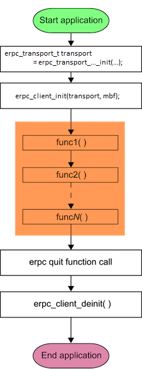
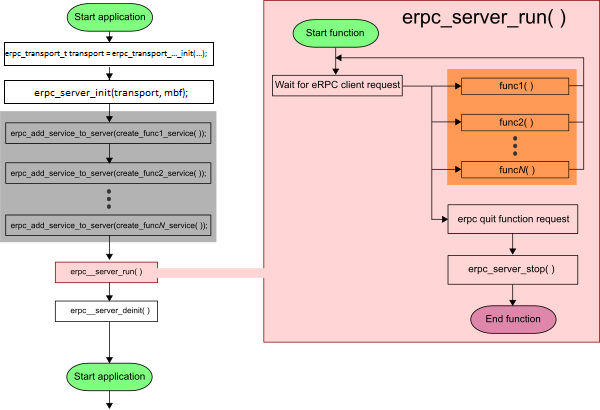
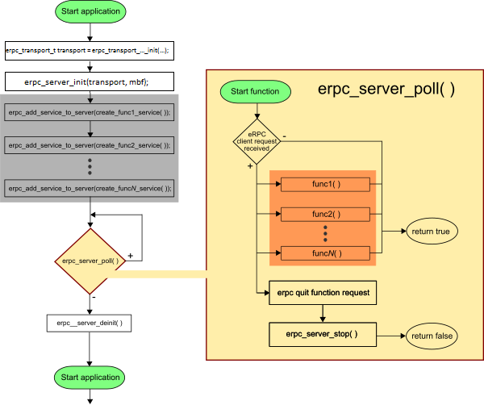

#This section describes the eRPC infrastructure, including infrastructure classes, and eRPC generator outputs.

## Infrastructure classes
The infrastructure source code (in C/C++) is stored in the ``erpc/erpc_c`` directory. For simple use in C code, C-wrapper functions have been created (see [C-wrapper functions](#C-wrapper-functions)) in erpc/erpc_c/setup folder. The infrastructure source code is split into 5 folders: *config*, *infra*, *port*, *setup*, and *transports*. The general rule for source code is for file names, which do not contain the word *server* or *client* in the name, are common files for both the server and client side.
Applications do not need to contain all of the existing files.

#### *config*
Holds the user-editable ``erpc_config.h`` header. This file can either be edited in place, or copied to the application code.

#### *infra*
Contains C++ infrastructure code used to build server and client applications. For most use cases, the APIs in the setup/folder are easier. Accessing the C++ layer directly is only required if you need to extend eRPC, or for atypical configurations.
__Common__:
* The ``erpc_message_buffer.h`` and ``erpc_message_buffer.cpp`` files contain functions for working with message buffers (reading/writing data and others).
* Codecs are used for data serialization. Prototypes of functions for codecs are declared in the ``erpc_codec.h`` file. The ``erpc_basic_codec.cpp`` file contains the first implementation of these functions.
__Client side__:
The role of client is to create and to send eRPC requests to the server, and to process the received response (if requested).
  * This is implemented in ``erpc_client_manager.h``/``.cpp`` files.
  * The main functions are ``createRequest()``, ``performRequest()``, and ``releaseRequest()``.
  * The transport layer and codec have to be set for the client manager.
__Server side__:
The role of the server is to receive eRPC requests from the client side, to execute requested functions, and to send the response back (if client requests a result).
* Prototypes of server functions are declared in server.h and common functions are defined in server.cpp. The ``erpc_simple_server.h``/``.cpp`` files contain the first implementation of server-declared functions.
* Transport layer and codec have to be set for the server.
* The ``erpc_server.h`` file also contains a prototype for a service class. For each interface declared in an IDL file, the definition for service is generated using the eRPC generator tool. These generated services must be added to the server after its initialization. Without this step, the server cannot handle client requests.
* The simple server contains 2 functions for message processing: ``run`` and ``poll``. The ``poll`` function only supports the RPMsg transport layer.
__Client-Server__:
For bidirectional communication has to be used both, client and server implementation on each side. For these, the use cases were created for the ``erpc_arbitrated_client_manager.h``/``.cpp`` and ``erpc_transport_arbitrator.h``/``.cpp`` files.
* The first two files are replacing ``erpc_client_manager.h``/``.cpp`` files to work with transport arbitrator.
* The second two files are special transport layer created for cooperation server/client implementation on one side.

#### *port*
Contains the eRPC porting layer to adapt to different environments.

#### *setup*
Contains a set of plain C APIs that wrap the C++ infrastructure, providing client and server init and deinit routines that greatly simplify eRPC usage in C-based projects. No knowledge of C++ is required to use these APIs.

#### *transports*
Contains transport classes for the different methods of communication supported by eRPC. Transport classes connect eRPC applications with drivers for different transport mediums. Some transports are applicable only to host PCs, while others are applicable only to embedded or multicore systems.
* Prototypes of functions for transport layers (which have to be declared for each transport medium that is used) are declared in the ``erpc_transport.h`` file.
* Each transport layer needs to at least send and the receive implementation.
Most transports have a corresponding C transport setup function in the setup/ folder.

Do not forget to add files with the prototypes described in each section into your application projects.

### Connections between user code, outputs from eRPC generator, and infrastructure classes
* Client and server applications have to initialize all infrastructures first (for example, server/client, transports, codecs, and others). Refer to infrastructure classes for additional information.
* For simple use of the C++ objects, C-wrapper functions have been created for C-users. See [C-wrapper functions](#C-wrapper-functions).

#### Client-side application
After an eRPC client initializes, the code is generated for the client side, and that code can be executed. This generated code for the client serializes data and uses the client object to create, perform, and release the request. When these client services are no longer needed, call the quit function to tell the server that these client services are not needed anymore, and to de-initialize the client object (including the transport and codec that were used).

#### Server-side application
After the eRPC server initializes, a service should be added to the server. Services are generated using the shim code for the server-side application. Each interface defined in an IDL file is generated as a server service (see interfaces and infrastructure classes). After that, the function for running the server can be executed. From this point in time, the server is waiting for requests from the client.

* When the server receives a message, the server identifies the right service from registered services, and calls the ``handleInvocation()`` function for this service. The ``handleInvocation()`` function is generated by the eRPC generator tool, and ``handleInvocation()`` provides the identification of which API function has to be executed.
* The called function performs data deserialization, and the corresponding function implementation is executed.
* If the API function returns a value(s), then the shim code serializes data for the client and sends it back (to the client).
* When server services are no longer requested, the server should receive the quit request. The quit function implementation should contain code for stopping the server (because the implementation of the run function is in a loop). When the server is stopped, the server object should be de-initialized (including the transport and codec that were used).

## C-wrapper functions
C-wrapper functions are designed for use by the eRPC infrastructure, and do not require any knowledge of C++ programming to use. C-wrapper functions simplify using the eRPC in an application. C-wrapper functions are stored in two places.

### Common: ``erpc/erpc_c/setup``
* ``<erpc_transport_setup.h>``: header file contains all init functions for all supported transport layers.
* ``<erpc_setup_<transport>.cpp>``: contains definitions of C-wrapper init functions for all supported transport layers, where ``<transport>`` specifies the type of transport layer.
* ``<erpc_mbf_setup.h>``: header file contains all init functions for all supported message buffer factory types. Not every message buffer factory type can be used with every transport type.
* ``<erpc_setup_<mbf>.cpp>``: contains definitions of C-wrapper init functions for all supported message buffer factory types, where ``<mbf>`` specifies the type of message buffer factory.

#### Common functions

##### *erpc_transport_`<transport>`_init(...)*
First, the client/server needs to call the transport init function. The name depends on used transport type. Parameters of the init function also depend on the used transport type. The returned value is placed as a parameter for the client/server init function.

#### *erpc_mbf_`<mbf>`_init(...)*
At the beginning client/server need also call message buffer factory init function. Name depends on used message buffer factory type. Parameters of init function also depend on used message buffer factory type. Returned value is placed as parameter for client/server init function.

### Client: ``erpc/erpc_c/setup``
* ``<erpc_client_setup.h>``: header file that contains declarations of C-wrapper functions for client purpose.
* ``<erpc_client_setup.cpp>``: source file that contains default definitions of C-wrapper functions for client purpose.
* ``<erpc_arbitrated_client_setup.h>``: header file that contains declarations of C-wrapper functions for client purpose when server is also presented on same side.
* ``<erpc_arbitrated_client_setup.h>``: source file that contains default definitions of C-wrapper functions for client purpose when server is also presented on same side.

#### Client-side functions

##### *erpc_client_init(erpc_transport_t transport, erpc_mbf_t message_buffer_factory)*
To initialize the client side of an eRPC application, the ``erpc_client_init`` function must be called. The ClientManager object is created here and the transport layer, codec, and message buffer factory are added into it. If the server is running, then the user can call functions generated from an IDL file. As the first function parameter is set to the return value from the transport init function. As the second function parameter is set to the return value from the message buffer factory init function.

##### *erpc_client_set_error_handler(client_error_handler_t error_handler)*
This API allows the client application to set the error handler function for handling errors which occur in the eRPC code.

##### *erpc_client_deinit()*
When the client is not needed anymore, the ``erpc_client_deinit()`` function should be called. ``erpc_client_deinit()`` frees all memory allocated for the client side of the application.

The following image represents the basic code flow on the client side, and shows the order in which ``erpc`` C-wrapper functions and generated ``erpc`` functions are executed.

##### *erpc_transport_t erpc_arbitrated_client_init(erpc_transport_t transport, erpc_mbf_t message_buffer_factory)*
Same as ``erpc_client_init(...)``, but ArbitratedClientManager is used. Returned transport has to be used for server init function instead of using transport init function.

##### *erpc_arbitrated_client_deinit()*
Same as ``erpc_client_deinit(...)``.

### Server: ``erpc/erpc_c/setup``
* ``<erpc_server_setup.h>``: header file that contains declarations of C-wrapper functions for server purpose.
* ``<erpc_server_setup.cpp>``: source file that contains default definitions of C-wrapper functions for server purpose.

#### Server-side functions

##### *erpc_server_init(erpc_transport_t transport, erpc_mbf_t message_buffer_factory)*
To initialize the server side of an eRPC application, the ``erpc_server_init()`` function must be called. The SimpleServer object is created here, and the transport layer, codec, and message buffer factory are added into it. After this initialization, one of the two functions to receive/send messages from/to the client should be called. As the first function parameter is set to the return value from the transport init function. As the second function parameter is set to the return value from the message buffer factory init function.

##### *erpc_server_deinit()*
When the server is no longer needed, the ``erpc_server_deinit()`` function should be called. ``erpc_server_deinit()`` frees all memory allocated for the server side of an application.

##### *erpc_add_service_to_server(void *service)*
Adds a service to the server. When the server gets a request from the client, the server searches in its registered services to find the correct action for this request. The generated function (from an IDL file) is passed as a parameter for this function. See the "Interfaces" section.

#### *erpc_server_run()*
Calls the implementation of the ``run()`` function of the SimpleServer class. This is the first possible type of function for handling messages received from the client.

##### *erpc_server_poll()*
Calls the implementation of the ``poll()`` function of the SimpleServer class. This is the second possible type of function for handling messages received from the client.
* When the server is still on, it returns true.
* When the server is not still on, it returns false.
  * If false is returned, then the ``erpc_server_deinit()`` function should be called to free allocated space. After that, the server application should not call the ``erpc_server_deinit()`` function again.

##### *erpc_stop_server()*
Informs the server that the client side will not use the server anymore.

The next two figures represent the basic code flow on the server side, and show the order in which ``erpc`` C-wrapper functions and generated ``erpc`` functions are executed. As depicted, when the client calls the quit function, the ``erpc_server_stop()`` function should be called from inside the quit function implementation.

The first figure shows an eRPC application that is using the ``erpc_server_run()`` function. The implementation of this function is called in a loop until the ``erpc_server_stop()`` function is called.

The second figure shows an eRPC application that is using the ``erpc_server_poll()`` function. The implementation of this function is called repeatedly. It is up to the server application (user code), when (and how often) the server calls this function. This function should not be called after the quit function eRPC request has been received, i.e., when the ``erpc_server_poll()`` function returns false.

