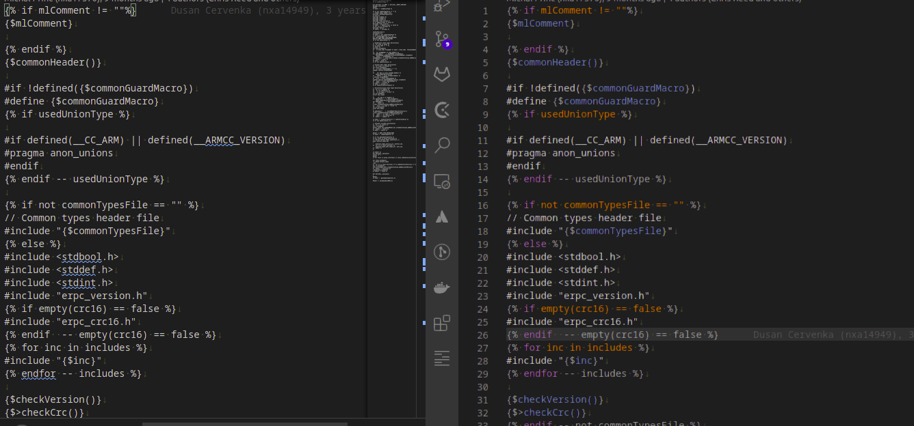

# erpc-code-style README

This exension formats code for eRPC related files. More about eRPC project is described on webpage: [github.com/EmbeddedRPC/erpc](https://github.com/EmbeddedRPC/erpc)

This extension was created thankfully this page and author of post:
[gcthesoftwareengineer.com/2017/01/how-to-create-custom-syntax-highlighting-in-a-visual-studio-code-extension/](https://gcthesoftwareengineer.com/2017/01/how-to-create-custom-syntax-highlighting-in-a-visual-studio-code-extension/)

## Features

This extension format erpc idl files and cpptemplate related files.

eRPC IDL example:

template example:

## Requirements

--

## Extension Settings

--

## Known Issues

--

## Release Notes

--

### 1.1.0

Minor fixes

- Added missing keywords
- Improved comments detection
- Improved annotations detection
- Added union support
- Improved parsing types
- Improved parsing functions

### 1.0.0

Initial release

- Covering most of usecases. Still some need be covered.
